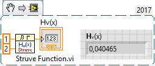

# anlys-test
How to call Analysis function from C++ and Rust

For example Struve:



### CVI

[Struve](https://www.ni.com/docs/en-US/bundle/labwindows-cvi/page/cvi/libref/cvistruve.htm)

```c
#include <advanlys.h> // for Struve
//...
int main (int argc, char *argv[])
{
    if (argc < 3 || argc > 4) usage (argv[0]);

    double x, v;
    if (parse_double(argv[1], "x", &x) != 0) return 1;
    if (parse_double(argv[2], "v", &v) != 0) return 1;

    double res = Struve(x, v);
    printf("Struve (%f, %f) = %f\n", x, v, res);
}
```

Documented - linked with advanlys.lib (refer to [Using LabWindows/CVI Libraries in External Compilers](https://www.ni.com/docs/en-US/bundle/labwindows-cvi/page/cvi/programmerref/using_cvi_libraries_in_external_compilers.htm)):

### MSVC

```c++
extern "C" {
    double Struve(double x, double u);
}
//...
int main(int argc, char* argv[])
{
    if (argc < 3 || argc > 4) usage(argv[0]);

    double x, v;
    if (parse_double(argv[1], "x", &x) != 0) return 1;
    if (parse_double(argv[2], "v", &v) != 0) return 1;

    double res = Struve(x, v);
    println("Struve ({}, {}) = {}", x, v, res);
}
```

### Rust

Build.rs:

```rust
fn main() {
	println!("cargo:rustc-link-lib=lib\\advanlys");
	println!("cargo:rustc-link-lib=user32");
}
```

Source

```rust
use std::env;
use std::ffi::c_double;
use std::process::exit;

unsafe extern "C" {
	pub fn Struve(x: c_double, v: c_double) -> c_double;
}
//...
fn main() {
	let args: Vec<String> = env::args().collect();
	if args.len() != 3 {
		usage(&args[0]);
	}

	let x: f64 = args[1].parse::<f64>().expect(
		"invalid x: expected a floating-point number (e.g., 1.23 or 1e-3)",
	);
	let v: f64 = args[2]
		.parse::<f64>()
		.expect("invalid v: expected a floating-point number (e.g., 0.5)");

	let res = unsafe { Struve(x as c_double, v as c_double) };
	println!("Struve({}, {}) = {}", x, v, res);
}
```

Undocumented - linked with lvanlys.lib (lvanlys.dll) from LabVIEW

### LV_MSVC

```c++
#include <print>     // C++23: std::print, std::println
#include <cstdlib>   // std::strtod, std::exit
#include <cerrno>    // errno, ERANGE

// If the library exports C symbols (no C++ name mangling)
extern "C" {
    double LV_Struve(double x, double u, double *Struve);
}
//...
int main(int argc, char* argv[])
{
    if (argc < 3 || argc > 4) usage(argv[0]);

    double x, v;
    if (parse_double(argv[1], "x", &x) != 0) return 1;
    if (parse_double(argv[2], "v", &v) != 0) return 1;

    double res;
	LV_Struve(x, v, &res);
    println("Struve ({}, {}) = {}", x, v, res);
}
```

### LV_Rust

Build.rs:

```rust
fn main() {
	println!("cargo:rustc-link-lib=lib\\lvanlys");
	println!("cargo:rustc-link-lib=user32");
}
```

Source:

```rust
use std::env;
use std::ffi::c_double;
use std::process::exit;

unsafe extern "C" {
	// C: void LV_Struve(double x, double v, double *Struve);
	pub fn LV_Struve(x: c_double, v: c_double, Struve: *mut c_double);
}
//...
fn main() {
	let args: Vec<String> = env::args().collect();
	if args.len() != 3 {
		usage(&args[0]);
	}

	let x: f64 = args[1].parse::<f64>().expect(
		"invalid x: expected a floating-point number (e.g., 1.23 or 1e-3)",
	);
	let v: f64 = args[2]
		.parse::<f64>()
		.expect("invalid v: expected a floating-point number (e.g., 0.5)");

	let mut res: c_double = 0.0;
	unsafe {
		// Call the C function: it writes into `res`
		LV_Struve(x as c_double, v as c_double, &mut res as *mut c_double);
	}
	println!("LV_Struve({}, {}) = {}", x, v, res as f64);
}
```

## TEST

```
C:\Users\Andrey\Desktop\anlys-test\build\CVI>TeStruve.exe 1 2
Struve (1.000000, 2.000000) = 0.040465

C:\Users\Andrey\Desktop\anlys-test\build\MSVC>AdvAnlys.exe 1 2
Struve (1, 2) = 0.040464636144794626

C:\Users\Andrey\Desktop\anlys-test\build\Rust>rustruve.exe 1 2
Struve(1, 2) = 0.040464636144794626

C:\Users\Andrey\Desktop\anlys-test\build\LV_MSVC>AdvAnlys.exe 1 2
Struve (1, 2) = 0.040464636144794626

C:\Users\Andrey\Desktop\anlys-test\build\LV_Rust>rustruve.exe 1 2
LV_Struve(1, 2) = 0.040464636144794626
```

